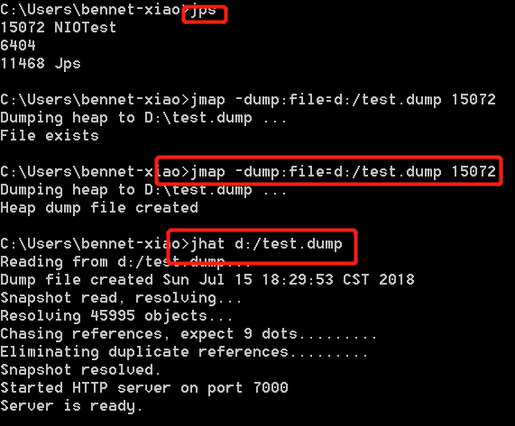
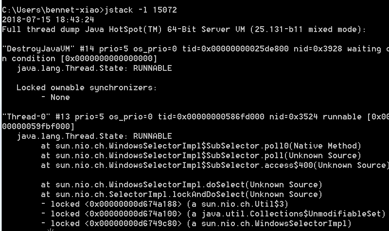

## 多线程

进程：进程是操作系统进行调度和分配系统资源的基本单位。

线程：线程是进程的一个实体（与进程的关系可看做Java中类与实例的关系），除与线程运行时必不可少的资源外不拥有自己的系统资源，与同属于一个进程的线程集合共享系统资源。

线程的几种状态：

```
   public enum State {
        /**
         * Thread state for a thread which has not yet started.
         */
        NEW,

        /**
         * Thread state for a runnable thread.  A thread in the runnable
         * state is executing in the Java virtual machine but it may
         * be waiting for other resources from the operating system
         * such as processor.
         */
        RUNNABLE,

        /**
         * Thread state for a thread blocked waiting for a monitor lock.
         * A thread in the blocked state is waiting for a monitor lock
         * to enter a synchronized block/method or
         * reenter a synchronized block/method after calling
         * {@link Object#wait() Object.wait}.
         */
        BLOCKED,

        /**
         * Thread state for a waiting thread.
         * A thread is in the waiting state due to calling one of the
         * following methods:
         * <ul>
         *   <li>{@link Object#wait() Object.wait} with no timeout</li>
         *   <li>{@link #join() Thread.join} with no timeout</li>
         *   <li>{@link LockSupport#park() LockSupport.park}</li>
         * </ul>
         *
         * <p>A thread in the waiting state is waiting for another thread to
         * perform a particular action.
         *
         * For example, a thread that has called <tt>Object.wait()</tt>
         * on an object is waiting for another thread to call
         * <tt>Object.notify()</tt> or <tt>Object.notifyAll()</tt> on
         * that object. A thread that has called <tt>Thread.join()</tt>
         * is waiting for a specified thread to terminate.
         */
        WAITING,

        /**
         * Thread state for a waiting thread with a specified waiting time.
         * A thread is in the timed waiting state due to calling one of
         * the following methods with a specified positive waiting time:
         * <ul>
         *   <li>{@link #sleep Thread.sleep}</li>
         *   <li>{@link Object#wait(long) Object.wait} with timeout</li>
         *   <li>{@link #join(long) Thread.join} with timeout</li>
         *   <li>{@link LockSupport#parkNanos LockSupport.parkNanos}</li>
         *   <li>{@link LockSupport#parkUntil LockSupport.parkUntil}</li>
         * </ul>
         */
        TIMED_WAITING,

        /**
         * Thread state for a terminated thread.
         * The thread has completed execution.
         */
        TERMINATED;
    }

```

Java中实现线程的几种方式：

1. 继承java.lang.Thread类，重写run方法。
2. 实现java.lang.Runnable接口。
3. 实现java.util.concurrent.Callable接口。
4. 线程池

**线程池：**

```
 /**
     * Creates a new {@code ThreadPoolExecutor} with the given initial
     * parameters.
     *
     * @param corePoolSize the number of threads to keep in the pool, even
     *        if they are idle, unless {@code allowCoreThreadTimeOut} is set
     * @param maximumPoolSize the maximum number of threads to allow in the
     *        pool
     * @param keepAliveTime when the number of threads is greater than
     *        the core, this is the maximum time that excess idle threads
     *        will wait for new tasks before terminating.
     * @param unit the time unit for the {@code keepAliveTime} argument
     * @param workQueue the queue to use for holding tasks before they are
     *        executed.  This queue will hold only the {@code Runnable}
     *        tasks submitted by the {@code execute} method.
     * @param threadFactory the factory to use when the executor
     *        creates a new thread
     * @param handler the handler to use when execution is blocked
     *        because the thread bounds and queue capacities are reached
     * @throws IllegalArgumentException if one of the following holds:<br>
     *         {@code corePoolSize < 0}<br>
     *         {@code keepAliveTime < 0}<br>
     *         {@code maximumPoolSize <= 0}<br>
     *         {@code maximumPoolSize < corePoolSize}
     * @throws NullPointerException if {@code workQueue}
     *         or {@code threadFactory} or {@code handler} is null
     */
    public ThreadPoolExecutor(int corePoolSize,
                              int maximumPoolSize,
                              long keepAliveTime,
                              TimeUnit unit,
                              BlockingQueue<Runnable> workQueue,
                              ThreadFactory threadFactory,
                              RejectedExecutionHandler handler) {
        if (corePoolSize < 0 ||
            maximumPoolSize <= 0 ||
            maximumPoolSize < corePoolSize ||
            keepAliveTime < 0)
            throw new IllegalArgumentException();
        if (workQueue == null || threadFactory == null || handler == null)
            throw new NullPointerException();
        this.corePoolSize = corePoolSize;
        this.maximumPoolSize = maximumPoolSize;
        this.workQueue = workQueue;
        this.keepAliveTime = unit.toNanos(keepAliveTime);
        this.threadFactory = threadFactory;
        this.handler = handler;
    }

```

构造线程池可以设置上面的几种参数。尽量避免使用Executors的几种构建线程池方法。按照当前的业务需求和环境通过ThreadPoolExecutor的构造函数自己定义线程池。workQueue尽量设置有界阻塞队列，避免内存溢出。


当等待队列满了之后：执行线程丢弃策略。

Jdk实现的线程池几种拒绝策略：（也可自定义，实现java.util.concurrent.RejectedExecutionHandler接口）

1. AbortPolicy：丢弃任务，并抛出RejectedExecutionException异常。
2. DiscardPolicy：直接丢弃任务。
3. DiscardOldestPolicy：线程池没有处于关闭的标识状态下，丢弃最先加入等待队列的线程。
4. CallerRunsPolicy：线程池没有处于关闭的标识状态下，将该任务交给主线程执行。

**线程安全：**

保证线程在操作临界资源时，该临界资源不被其他线程操作。


## IO流体系


输入流：将数据读入内存

输出流：将数据从内存中输出


**BIO：**


适用于Jdk1.4以前或连接数比较少的IO。


**NIO:** Jdk1.4以后支持

NIO 是一种同步非阻塞的 IO 模型。 同步是指线程不断轮询 IO 事件是否就绪，非阻塞是指线程在等待 IO 的时候，可以同时做其他任务。同步的核心就是 Selector，Selector 代替了线程本身轮询 IO 事件，避免了阻塞同时减少了不必要的线程消耗；非阻塞的核心就是通道和缓冲区，当 IO 事件就绪时，可以通过写道缓冲区，保证 IO 的成功，而无需线程阻塞式地等待。 

Chanel：

Channel是NIO中用来读取和写入数据的通道。Jdk中提供了以下几种实现：

- FileChannel
- DatagramChannel
- SocketChannel
- ServerSocketChannel

Buffer：

NIO中直接在堆内（Heap-Buffer）或堆外（Direct-Buffer）内存创建的数据缓冲区，在NIO中所有数据的读和写都离不开Buffer。 Jdk中提供了以下Buffer实现：

- ByteBuffer
- CharBuffer
- DoubleBuffer
- FloatBuffer
- IntBuffer
- LongBuffer
- ShortBuffer

Selector:

Selector允许单线程处理多个 Channel。 


Java中使用NIO的实例：

```
package com.test;

import java.net.InetAddress;
import java.net.InetSocketAddress;
import java.nio.ByteBuffer;
import java.nio.CharBuffer;
import java.nio.channels.SelectionKey;
import java.nio.channels.Selector;
import java.nio.channels.ServerSocketChannel;
import java.nio.channels.SocketChannel;
import java.nio.charset.Charset;
import java.nio.charset.CharsetDecoder;
import java.util.Iterator;
import java.util.Set;

/**
 * @author bennet-xiao
 * @create_time 2018-07-15 17:28:09
 * @todo NIO的使用实例
 * @class com.test.NIOTest
 */
public class NIOTest implements Runnable{
     //chanel的id
	 public int id = 100001;
	 //缓冲区大小
	 public int bufferSize = 2048;
	 
	@Override
	public void run() {
		 init();
	}
	
	/**
	 * @author bennet-xiao
	 * @create_time 2018-07-15 17:36:12
	 * @todo 初始化话ServerSocketChanel绑定端口监听通道
	 */
	private void init() {
        try {
            // 创建通道和选择器
            ServerSocketChannel socketChannel = ServerSocketChannel.open();
            Selector selector = Selector.open();
            InetSocketAddress inetSocketAddress = new InetSocketAddress(
                    InetAddress.getLocalHost(), 9080);
            socketChannel.socket().bind(inetSocketAddress);
            // 设置通道非阻塞 绑定选择器
            socketChannel.configureBlocking(false);
            //将通道注册到选择器上
            socketChannel.register(selector, SelectionKey.OP_ACCEPT).attach(
                    id++);
            System.out.println("Server started .... port:9080");
            listener(selector);

        } catch (Exception e) {
            // TODO: handle exception
        	e.printStackTrace();
        }
    }
	
	
	/**
	 * @author bennet-xiao
	 * @create_time 2018-07-15 17:38:28
	 * @todo 监听selector上的ServerSocketChannel事件
	 * @param selector
	 */
	public void listener(Selector selector) {
        try {
            while (true) {
                Thread.sleep(1*1000);
                selector.select(); // 阻塞 直到有就绪事件为止
                Set<SelectionKey> readySelectionKey = selector
                        .selectedKeys();
                Iterator<SelectionKey> it = readySelectionKey.iterator();
                while (it.hasNext()) {
                    SelectionKey selectionKey = it.next();
                    // 判断是哪个事件
                    if (selectionKey.isAcceptable()) {// 客户请求连接
                        System.out.println(selectionKey.attachment()
                                + " - 接受请求事件");
                        // 获取通道 接受连接,
                        // 设置非阻塞模式（必须），同时需要注册 读写数据的事件，这样有消息触发时才能捕获
                        ServerSocketChannel serverSocketChannel = (ServerSocketChannel) selectionKey
                                .channel();
                        serverSocketChannel
                                .accept()
                                .configureBlocking(false)
                                .register(
                                		selector,
                                        SelectionKey.OP_READ
                                                | SelectionKey.OP_WRITE).attach(id++);
                        System.out
                                .println(selectionKey.attachment() + " - 已连接");
                    }
                    if (selectionKey.isReadable()) {// 读数据
                        System.out.println(selectionKey.attachment()
                                + " - 读数据事件");
                        SocketChannel clientChannel=(SocketChannel)selectionKey.channel();
                        ByteBuffer receiveBuf = ByteBuffer.allocate(bufferSize);
                        clientChannel.read(receiveBuf);
                        System.out.println(selectionKey.attachment()
                                + " - 读取数据：" + getString(receiveBuf));
                    }
                    if (selectionKey.isWritable()) {// 写数据
                        System.out.println(selectionKey.attachment()
                                + " - 写数据事件");
                        SocketChannel clientChannel = (SocketChannel) selectionKey.channel();
                        ByteBuffer sendBuf = ByteBuffer.allocate(bufferSize);
                        String sendText = "hello\n";
                        sendBuf.put(sendText.getBytes());
                        sendBuf.flip();        //写完数据后调用此方法
                        clientChannel.write(sendBuf);
                    }
                    if (selectionKey.isConnectable()) {
                        System.out.println(selectionKey.attachment()
                                + " - 连接事件");
                    }
                    // 必须removed 否则会继续存在，下一次循环还会进来,
                    // 注意removed 的位置，针对一个.next() remove一次
                    it.remove(); 
                }
            }
        } catch (Exception e) {
            // TODO: handle exception
            System.out.println("Error - " + e.getMessage());
            e.printStackTrace();
        }

    }
	
	
	/**
	 * @author bennet-xiao
	 * @create_time 2018-07-15 17:32:05
	 * @todo 將ByteBuffer转为String
	 * @param buffer
	 * @return
	 */
	public static String getString(ByteBuffer buffer)
    {
		Charset charset = null;  
        CharsetDecoder decoder = null;  
        CharBuffer charBuffer = null;  
        try  
        {  
            charset = Charset.forName("UTF-8");  
            decoder = charset.newDecoder();  
            // charBuffer = decoder.decode(buffer);//用这个的话，只能输出来一次结果，第二次显示为空  
            charBuffer = decoder.decode(buffer.asReadOnlyBuffer());  
            return charBuffer.toString();  
        }  
        catch (Exception ex)  
        {  
            ex.printStackTrace();  
            return "";  
        }  
    }

}

```

Selector轮询到已完成的IO时，将新起一个线程，处理相关逻辑。

适用于连接数比较多且连接比较短的IO。


**AIO：（NIO2.0）** Jdk1.7以后支持

AIO是异步非阻塞的IO模型，比起NIO主要是将Selector的轮训Chanel机制改为事件驱动，当操作系统完成某个IO时，自动调用其中的回调函数（CompletionHandler ），与NIO相比主要增加了以下几个异步通道的实现：

- AsynchronousSocketChannel
- AsynchronousServerSocketChannel
- AsynchronousFileChannel
- AsynchronousDatagramChannel

适用于连接数比较多且连接比较长的IO。


# Java的内存模型：

详见[基于Hotspot的VM内存模型及GC理解](https://blog.csdn.net/weixin_41896427/article/details/79962515)，整理by 

http://www.oracle.com/technetwork/java/javase/tech/memorymanagement-whitepaper-1-150020.pdf

JVM的启动参数：

参考http://www.oracle.com/technetwork/java/javase/tech/vmoptions-jsp-140102.html


# JVM的heap dump分析：

Jps查看运行的Java应用进程

1、-XX:+HeapDumpOnOutOfMemoryError 自动生成heap dump文件。

2、jmap工具生成进程下的内存使用快照dump文件，里面包括堆、永久代（meatdata）、垃圾收集器的使用及分配情况

利用jhat工具分析查看各个对象使用内存情况

例子：生成dump



访问对应http://localhost:7000 可以看到对应类的情况比如有多少个实例、引用、子类、父类、占用内存，执行OQL语言查看类的信息等等


# Jstack使用分析：

通过jstack可以查看当前进程下应用所有正在运行的线程堆栈调用情况：

**线程的几种状态：**

1、RUNNABLE，线程处于执行中 

2、BLOCKED，线程被阻塞 

3、WAITING，线程正在等待 

**线程获取对象锁：**

进入区(Entrt Set):表示线程通过synchronize要求获取对象的锁。如果对象未被锁住,则进入拥有者状态;否则则在进入区等待。一旦对象锁被其他线程释放,立即参与竞争。

拥有者(The Owner):表示某一线程成功竞争到对象锁。

等待区(Wait Set):表示线程通过对象的wait方法,释放对象的锁,并在等待区等待被唤醒。

 堆栈信息中：

1. locked <地址>    说明线程对地址对象进行了加锁。
2. waiting to lock   <地址>  没有获取到了对象的锁,线程在监视器的进入区等待。
3. waiting on <地址>  成功获取到了对象的锁后,调用了wait方法,进入对象的等待区等待。 

通过该堆栈信息可以看出应用是否在竞争资源，造成死锁。

一定时间段内，重复执行堆栈信息，对比堆栈信息可看出方法执行效率，及定位有问题代码。

例子：




该线程处于Runnable状态，获取到三个对象锁，等待客户端chanel操作。